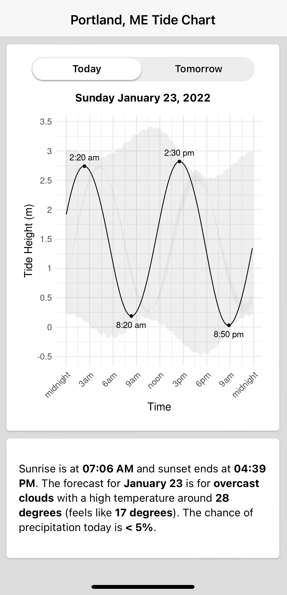

# portland-tide

A Saturday fun-project when the temp didn't exceed 15 degrees F. Also, a shiny-based PWA to display the daily tide-chart for Portland, ME so we know when to take the dogs to the beach. And because the free tide websites are annoyingly bloated with ads. 

Built using {shinyMobile} from RInterface (https://github.com/RinteRface/shinyMobile/). Tide data from {rtide}. 

PWA enabled. On iOS devices, open the link in safari, hit share, then add to home screen. 

The beach lovers are Murphy and Willa. 

